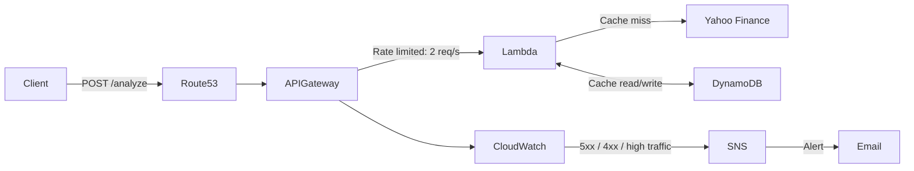

# PassivEdge Backend

Serverless stock analysis API that calculates daily price deviation patterns across configurable time periods. Built on AWS with infrastructure as code.

## Tech Stack

**Application:** Python 3.12 | AWS Lambda (Docker) | DynamoDB | Yahoo Finance (yfinance)

**Infrastructure:** AWS CDK | API Gateway | Route53 | CloudWatch Alarms | SNS

## Architecture



## API Reference

### `POST /analyze`

Analyzes daily price deviation from the monthly average for a given stock.

**Request:**
```json
{
  "symbol": "AAPL",
  "start": "2024-01",
  "end": "2024-06"
}
```

**Response:**
```json
{
  "symbol": "AAPL",
  "period": {
    "start": "2024-01",
    "end": "2024-06"
  },
  "days": {
    "1": { "avg_price_diff": "0.42" },
    "2": { "avg_price_diff": "-0.18" },
    "3": { "avg_price_diff": "1.05" }
  }
}
```

Each day's `avg_price_diff` represents the average percentage deviation of that day's closing price from the monthly mean, aggregated across all months in the requested period.

**Errors:**

| Status | Cause |
|--------|-------|
| 400 | Missing/invalid request body, missing required fields |
| 404 | Symbol doesn't exist or no data for requested period |

```json
{ "statusCode": 400, "message": "Missing required field: symbol" }
```

## Project Structure

```
├── stock-analyzer/              # Lambda function
│   ├── dockerfile
│   ├── requirements.txt
│   └── src/
│       ├── handler.py           # API entry point (Lambda Powertools)
│       ├── models/
│       │   ├── analysis/        # StockAnalysis, DayScore (frozen dataclasses)
│       │   └── date/            # MonthDate, MonthPeriod (validation + iteration)
│       ├── schemas/
│       │   └── validate.py      # Request validation
│       └── services/
│           ├── aggregator/      # Multi-month analysis aggregation
│           ├── cache/           # Cache-aside pattern (abstract base + DynamoDB)
│           └── stock_fetcher/   # Yahoo Finance data fetching
│
└── infra/                       # AWS CDK infrastructure
    ├── app.py                   # Stack definition
    ├── cdk.json
    └── resources/
        ├── api_gateway.py       # REST API + custom domain + TLS
        ├── lambda_fn.py         # Docker-based Lambda function
        ├── dynamodb.py          # Cache table
        ├── route53.py           # DNS zone lookup
        └── alarms.py            # CloudWatch alarms + SNS notifications
```

## Design Decisions

- **Cache-aside pattern** -- An abstract `BaseCache` class acts as a decorator around the fetcher callable. `DynamoDBCache` implements it, making the cache layer swappable without touching business logic.
- **Aggregation via composition** -- `StockAggregator` takes any `Callable[[str, MonthDate], StockAnalysis]` as its fetcher, which in practice is the cache-wrapped fetcher. This keeps aggregation decoupled from both fetching and caching.

## Getting Started

### Prerequisites

- Python 3.12+
- AWS CLI configured with credentials
- AWS CDK CLI (`npm install -g aws-cdk`)
- Docker

### Configure CDK Context

Create `infra/cdk.context.json`:
```json
{
  "domain-name": "yourdomain.com",
  "alert-email": "alerts@yourdomain.com"
}
```

A Route53 hosted zone for the domain must already exist in your AWS account.

### Deploy

```bash
cd infra
pip install -r requirements.txt
cdk deploy
```

CDK will build the Docker image, push it to ECR, and provision all resources.
